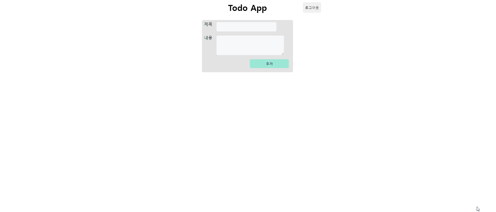

# 원티드 프리온보딩 프론트엔드 챌린지 8월: CRUD w React Query

## 실행 방법

- server

    ```shell
    git clone https://github.com/yujinwon-dev/wanted-pre-onboarding-challenge-fe-1-api.git
    yarn install
    yarn start
    ```
- client

    ```shell
    git clone https://github.com/yujinwon-dev/wanted-pre-onboarding-challenge-fe-1.git
    npm install
    npm run dev
    ```


## 목차

- [기술 스택](##기술-스택)

- [리팩토링 과정](##리팩토링-과정)
- [폴더 구조](##폴더-구조)
- [과제 구현 목록](##과제-구현-목록)
- [고민한 부분](##고민한-부분)
- [한계점 및 개선 사항](##한계점-및-개선-사항)


## 기술 스택

- React
- TypeScript
  - 컴파일 단계에서 에러를 확인&해결하고 API 응답 데이터를 더 편리하게 처리하기 위해 사용했습니다.

- Vite
  - 코드 작성 및 수정 사항을 빠르게 확인하기 위해 사용했습니다.

- react-query
  - 서버 관련 코드와 상태를 클라이언트와 구분하여 처리하기 위해 사용했습니다.

- styled-components
  - css를 컴포넌트 형태로 파악하고 이후 중복되는 css를 import하여 이용할 목적으로 사용했습니다.

- react-toastify
  - 지금은 UI 컴포넌트로 토스트만 필요하기 때문에 UI 프레임워크 대신 토스트만 제공하는 패키지를 사용했습니다.


## 리팩토링 과정

- [1차 리팩토링](https://velog.io/@wonyuuu/React-Todo-App-%EB%A6%AC%ED%8C%A9%ED%86%A0%EB%A7%81)
- [2차 리팩토링](https://velog.io/@wonyuuu/React-Todo-App%EC%97%90-React-Query-%EC%A0%81%EC%9A%A9%ED%95%98%EA%B8%B0) ([PR](https://github.com/yujinwon-dev/wanted-pre-onboarding-challenge-fe-1/pull/1))


## 폴더 구조
```
├── 📂src
|  ├── 📂api
|  |  ├── 💾auth.ts
|  |  ├── 💾axios.ts
|  |  └── 💾todo.ts
|  ├── 📂components
|  |  ├── 📂common
|  |  |  ├── 💾Form.tsx
|  |  |  ├── 💾Loader.tsx
|  |  |  ├── 💾LogoutButton.tsx
|  |  |  └── 💾SubmitButton.tsx
|  |  └── 📂todo
|  |     ├── 💾TodoForm.tsx
|  |     └── 💾TodoItem.tsx
|  ├── 📂hooks
|  |  ├── 📂queries
|  |  |  ├── 💾useAuth.ts
|  |  |  ├── 💾useMutateTodo.ts
|  |  |  └── 💾useTodo.ts
|  |  ├── 💾useAuthToken.ts
|  |  └── 💾useTokenCheck.ts
|  ├── 📂pages
|  |  ├── 💾Detail.tsx
|  |  ├── 💾Home.tsx
|  |  ├── 💾Intro.tsx
|  |  ├── 💾Login.tsx
|  |  ├── 💾PrivateRoute.tsx
|  |  └── 💾SignUp.tsx
|  ├── 📂types
|  |  ├── 💾auth.ts
|  |  └── 💾todo.ts
|  ├── 📂utils
|  |  ├── 💾formInputRule.ts
|  |  └── 💾toastOptions.ts
|  ├── 💾App.tsx
|  ├── 💾index.css
|  ├── 💾main.tsx
|  └── 💾vite-env.d.ts
├── 💾tsconfig.json
├── 💾tsconfig.node.json
└── 💾vite.config.ts
```


## 실행 화면

### Login / SignUp


### Todo Create / Read



### Todo Update / Delete


## 과제 구현 목록

### Assignment 1 - Login / SignUp

- /auth 경로에 로그인 / 회원가입 기능을 개발합니다

  - 로그인, 회원가입을 별도의 경로로 분리해도 무방합니다

  - [x] 최소한 이메일, 비밀번호 input, 제출 button을 갖도록 구성해주세요

- 이메일과 비밀번호의 유효성을 확인합니다

  - [x] 이메일 조건 : 최소 `@`, `.` 포함

  - [x] 비밀번호 조건 : 8자 이상 입력

  - [x] 이메일과 비밀번호가 모두 입력되어 있고, 조건을 만족해야 제출 버튼이 활성화 되도록 해주세요

- 로그인 API를 호출하고, 올바른 응답을 받았을 때 루트 경로로 이동시켜주세요

  - [x] 응답으로 받은 토큰은 로컬 스토리지에 저장해주세요

  - [x] 다음 번에 로그인 시 토큰이 존재한다면 루트 경로로 리다이렉트 시켜주세요

  - [x] 어떤 경우든 토큰이 유효하지 않다면 사용자에게 알리고 로그인 페이지로 리다이렉트 시켜주세요

### Assignment 2 - Todo List

- Todo List API를 호출하여 Todo List CRUD 기능을 구현해주세요

  - [x] 목록 / 상세 영역으로 나누어 구현해주세요

  - [x] Todo 목록을 볼 수 있습니다.

  - [x] Todo 추가 버튼을 클릭하면 할 일이 추가 됩니다.

  - [x] Todo 수정 버튼을 클릭하면 수정 모드를 활성화하고, 수정 내용을 제출하거나 취소할 수 있습니다.

  - [x] Todo 삭제 버튼을 클릭하면 해당 Todo를 삭제할 수 있습니다.
- 한 화면 내에서 Todo List와 개별 Todo의 상세를 확인할 수 있도록 해주세요.

  - [x] 새로고침을 했을 때 현재 상태가 유지되어야 합니다.

  - [x] 개별 Todo를 조회 순서에 따라 페이지 뒤로가기를 통하여 조회할 수 있도록 해주세요.
- 한 페이지 내에서 새로고침 없이 데이터가 정합성을 갖추도록 구현해주세요
  - [x] 수정되는 Todo의 내용이 목록에서도 실시간으로 반영되어야 합니다


## 고민한 부분

어떻게 하면 적절하게 관심사를 분리하고 함수/컴포넌트를 추상화할 수 있을지 고민했습니다.

다른 분들의 코드를 참고해서 React Query의 커스텀 훅을 만들어 내부 함수로 만들면서

이러한 방법도 있다는 것을 알게 되었습니다. 폴더 구조는 현 상태도 아쉬운 것 같다는 생각이 들어서

pages, components 폴더에서 응집도가 높은 컴포넌트를 적절히 묶을 방법을 좀 더 고민해보고자 합니다.

그리고 API 요청 시 비동기 처리 로직의 위치(API 요청 함수 or 해당 함수 호출 부분)도 고민이 많았습니다.

에러는 가급적 노출하는 게 바람직하다는 것을 배우고 함수 호출 부분에 구현했으나 UI 관련 로직과

분리가 적절히 되지 않은 점이 아쉬웠습니다. 이후 React Query를 적용하며 더 나은 방법을 찾고 있습니다.


## 한계점 및 개선 사항

- [ ] react-query Query Key 파일 분리
- [ ] 전체적인 UI 개선
- [ ] 로그인, 회원가입 유효성 검사 실시간 피드백
- [ ] 반응형 구현
- [ ] 404 페이지 구현
